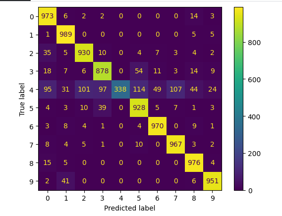

# Fine-tuning  Transformers For Image Classification  

|name|initialized checkpoint|crop size|#params|accuracy|
|:-----------|:---------------------|:---------:|:-------:|:-------|
|mobilevit_s|[model.pth](https://github.com/giriprasad51/image_classification_project/blob/main/model.pth)|224x224|5.596M|0.8900|




## Setup

First, clone the repo and install required packages:
```
!git clone https://github.com/giriprasad51/image_classification_project.git
cd image_classification_project
pip install -r requirements.txt
```


## Demo
[(https://github.com/giriprasad51/image_classification_project/blob/main/video.webm)]