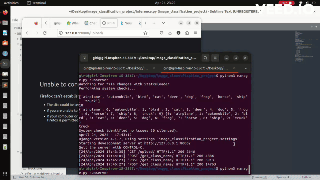

# Fine-tuning Transformers For Image Classification

| name        | self - supervised                           | initialized checkpoint                                                                                    | crop size | #params | accuracy | Kaggle Notebook                                                                                               |
| :---------- | :------------------------------------------ | :-------------------------------------------------------------------------------------------------------- | :-------: | :-----: | :------- | :------------------------------------------------------------------------------------------------------------ |
| ViT | <span style="color:red"> [ ✗ ] </span>        | [vit_checkpoint](https://www.kaggle.com/code/giriprasad512/cifar-10-vitforimageclassification/output)             |  224x224  | 85M  | 0.9561   | [cifar-10-mobilevit-s.ipynb](https://www.kaggle.com/code/giriprasad512/cifar-10-vitforimageclassification)
| BEiT        | <span style="color:lightgreen"> [ ✓ ] </span> | [beit_checkpoint](https://www.kaggle.com/code/giriprasad512/cifar-10-by-fine-tuning-beit/output) |  224x224  |   87M   | 0.9505   | [cifar-10-by-fine-tuning-beit.ipynb](https://www.kaggle.com/code/giriprasad512/cifar-10-by-fine-tuning-beit/) | 
| mobilevit_s | <span style="color:red"> [ ✗ ] </span>        | [model.pth](checkpoints/model.pth)             |  224x224  | 5M   | 0.8900   | [cifar-10-mobilevit-s.ipynb](https://www.kaggle.com/code/giriprasad512/cifar-10-mobilevit-s)                  |

## Confusion Matrixs

<table>
  
  <tr>
    <td valign="top"></td>
    <td valign="top"></td>
    <td valign="top"></td>
  </tr>
  <tr>
    <td> ViT </td>
     <td> BEiT </td>
     <td> Vit-s </td>
  </tr>
 </table>

## Setup

First, clone the repo and install required packages:

```
!git clone https://github.com/giriprasad51/image_classification_project.git
cd image_classification_project
pip install -r requirements.txt
```

## Demo

<!-- [](https://github.com/giriprasad51/image_classification_project/blob/main/video.mp4) -->




